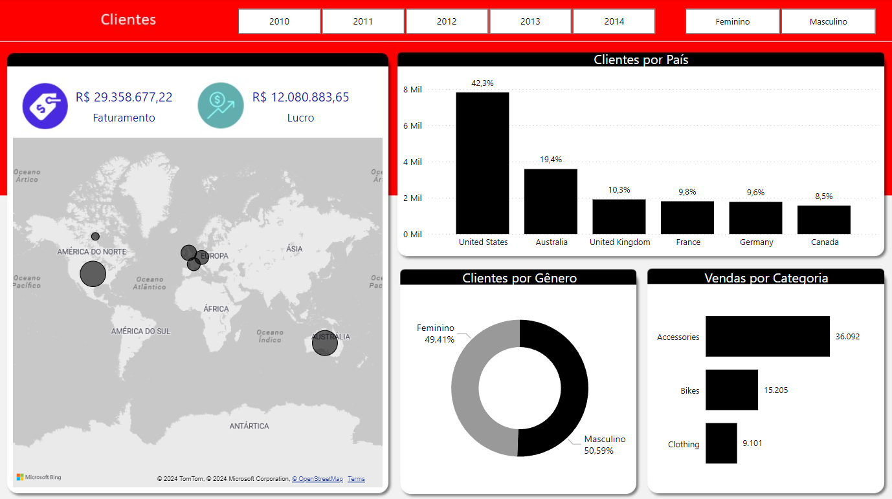

# Projeto de Integração SQL Server e Power BI
## Apresentação
O projeto de integração entre SQL Server e Power BI tem como objetivo criar uma visualização analítica robusta e detalhada, utilizando o banco de dados AdventureWorks 2014. Este projeto permitirá a análise de diversos indicadores de performance relacionados às vendas e aos clientes, proporcionando insights valiosos para a tomada de decisões estratégicas.
## Download do Banco de Dados AdventureWorks 2022
O banco de dados AdventureWorks 2022 pode ser baixado e configurado seguindo as instruções disponíveis no link oficial da Microsoft: [AdventureWorks 2022 - Instruções de Instalação e Configuração](https://learn.microsoft.com/pt-br/sql/samples/adventureworks-install-configure?view=sql-server-ver16&tabs=ssms).
## Definindo os Indicadores do Projeto
### Aba Geral:
* Receita Total
* Quantidade Vendida
* Total de Categorias de Produtos
* Quantidade de Clientes
* Receita Total e Lucro Total por Mês
* Margem de Lucro
* Quantidade Vendida por Mês
* Lucro por País
### Aba Clientes:
* Vendas por País
* Clientes por País
* Vendas por Gênero
* Vendas por Categoria
## Definindo as Tabelas e Colunas a Serem Usadas no Projeto
### Tabelas:
* **FactInternetSales**
* **DimProductCategory**
* **DimCustomer**
* **DimGeography**
### Colunas:
* SalesOrderNumber (FactInternetSales)
* OrderDate (FactInternetSales)
* EnglishProductCategoryName (DimProductCategory)
* CustomerKey (DimCustomer)
* FirstName + ' ' + LastName (DimCustomer)
* Gender (DimCustomer)
* EnglishCountryRegionName (DimGeography)
* OrderQuantity (FactInternetSales)
* SalesAmount (FactInternetSales)
* TotalProductCost (FactInternetSales)
* SalesAmount - TotalProductCost (FactInternetSales)
## Criando a View  vw_AnaliseVendas
Para facilitar a visualização dos dados no Power BI, será criada uma view chamada **vw_AnaliseVendas:**

```-- Criação ou alteração da view RESULTADOS_ADW
CREATE OR ALTER VIEW vw_AnaliseVendas AS
SELECT
    -- Número do pedido de venda
    fis.SalesOrderNumber AS 'NumeroPedido',
    
    -- Data do pedido de venda
    fis.OrderDate AS 'DataPedido',
    
    -- Nome da categoria do produto (em inglês)
    dpc.EnglishProductCategoryName AS 'CategoriaProduto',
    
    -- Chave do cliente (ID)
    fis.CustomerKey AS 'IDCliente',
    
    -- Nome completo do cliente
    dc.FirstName + ' ' + dc.LastName AS 'NomeCliente',
    
    -- Gênero do cliente (substituindo 'M' por 'Masculino' e 'F' por 'Feminino')
    REPLACE(REPLACE(dc.Gender, 'M', 'Masculino'), 'F', 'Feminino') AS 'GeneroCliente',
    
    -- Nome do país do cliente (em inglês)
    dg.EnglishCountryRegionName AS 'PaisCliente',
    
    -- Quantidade vendida
    fis.OrderQuantity AS 'QuantidadeVendida',
    
    -- Valor da venda
    fis.SalesAmount AS 'ValorVenda',
    
    -- Custo total da venda
    fis.TotalProductCost AS 'CustoVenda',
    
    -- Lucro da venda (valor da venda menos o custo total)
    fis.SalesAmount - fis.TotalProductCost AS 'LucroVenda'
 
FROM FactInternetSales fis
-- Relacionamento com a tabela de produtos
INNER JOIN DimProduct dp ON fis.ProductKey = dp.ProductKey
-- Relacionamento com a subcategoria dos produtos
INNER JOIN DimProductSubcategory dps ON dp.ProductSubcategoryKey = dps.ProductSubcategoryKey
-- Relacionamento com a categoria dos produtos
INNER JOIN DimProductCategory dpc ON dps.ProductCategoryKey = dpc.ProductCategoryKey
-- Relacionamento com a tabela de clientes
INNER JOIN DimCustomer dc ON fis.CustomerKey = dc.CustomerKey
-- Relacionamento com a tabela de geografia (localização dos clientes)
INNER JOIN DimGeography dg ON dc.GeographyKey = dg.GeographyKey
 ```

## Relacionamentos Entre Tabelas
Para a correta análise dos dados, serão definidos relacionamentos entre as tabelas:
### Tabelas a Serem Analisadas:
* **FactInternetSales**
* **DimCustomer**
* **DimSalesTerritory**
* **DimProductCategory**
 
Nota: A tabela **DimProductCategory** necessitará de um relacionamento em cadeia com outras tabelas de produtos para garantir a integridade e a completude dos dados analisados.
## Relacionamentos Entre Tabelas
Para a correta análise dos dados no Power BI, é necessário definir relacionamentos entre as tabelas envolvidas. Aqui estão os relacionamentos principais que devem ser estabelecidos:
1. **FactInternetSales** e **DimCustomer**
    - Relacionar a coluna **CustomerKey** em **FactInternetSales** com a coluna **CustomerKey** em **DimCustomer**.
2. **FactInternetSales** e **DimGeography**
    - Relacionar a coluna **GeographyKey** em **DimCustomer** com a coluna **GeographyKey** em **DimGeography**.
4. **FactInternetSales** e **DimProductCategory**
    - Relacionar a coluna **ProductKey** em **FactInternetSales** com a coluna **ProductKey** em **DimProduct**.
    - Em seguida, relacionar a coluna **ProductSubcategoryKey** em **DimProduct** com a coluna **ProductSubcategoryKey** em **DimProductSubcategory**.
    - Por fim, relacionar a coluna **ProductCategoryKey** em **DimProductSubcategory** com a coluna **ProductCategoryKey** em **DimProductCategory**.
Esses relacionamentos permitirão a análise completa dos dados de vendas em relação aos clientes, localização geográfica e categorias de produtos.
## Criando Medidas no Power BI
Após a importação dos dados no Power BI, será necessário criar medidas para calcular os indicadores definidos. Aqui estão alguns exemplos de medidas que podem ser criadas:

* **Receita Total**

* **Quantidade Vendida**

*  **Total de Categorias de Produtos**

* **Quantidade de Clientes**

* **Receita Total por Mês**

* **Lucro Total por Mês**

* **Margem de Lucro**

* **Quantidade Vendida por Mês**

* **Lucro por País**


## Criação dos Dashboards no Power BI
Com os dados e medidas importados, será realizado um dashboard no Power BI para visualizar os indicadores de forma clara e intuitiva. Algumas opções de visualização incluem:
### Aba Geral:
* Gráfico de barras para Receita Total por Categoria de Produto.
* Gráfico de linhas para Receita Total e Lucro Total por Mês.
* Cartão para exibir a Quantidade de Clientes.
* Gráfico de linhas para Quantidade Vendida por Mês.
* Mapa para visualizar o Lucro por País.
### Aba Clientes:
* Mapa para exibir Vendas por País.
* Gráfico de barras empilhadas para Clientes por País.
* Gráfico de pizza para Vendas por Gênero.
* Gráfico de barras para Vendas por Categoria de Produto.

## Dashboard Final


## Considerações Finais
O projeto de integração entre SQL Server e Power BI utilizando o banco de dados AdventureWorks 2022 visa fornecer uma solução completa para análise de dados de vendas e clientes. Através da definição de indicadores, criação de views, estabelecimento de relacionamentos e desenvolvimento de dashboards, é possível obter insights valiosos que podem auxiliar na tomada de decisões estratégicas para a organização.
